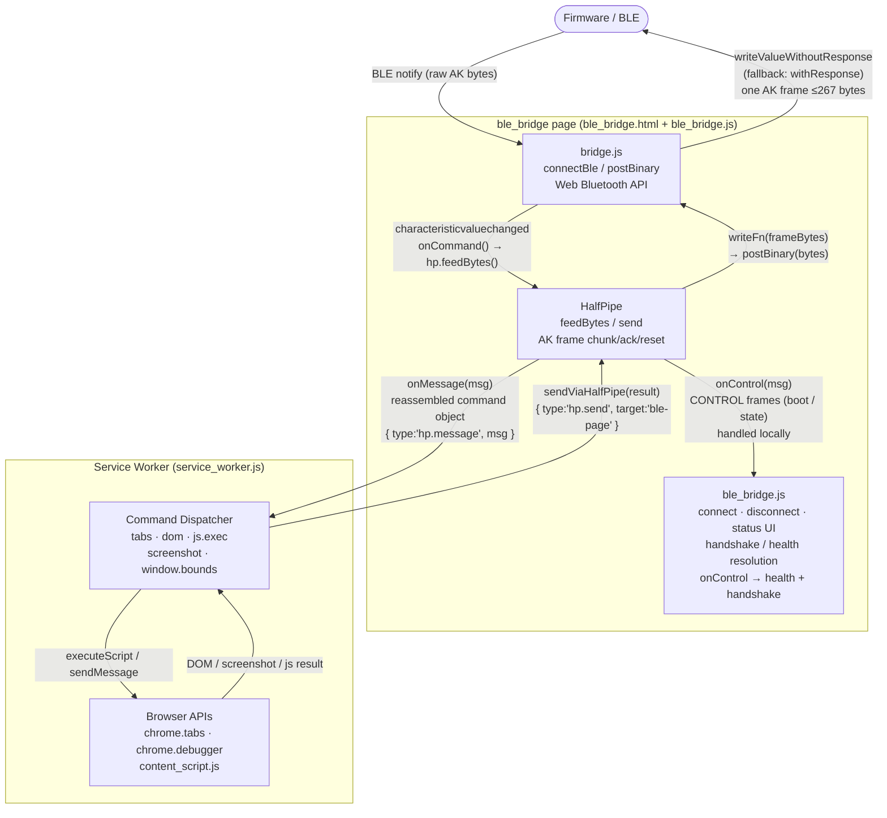

# Architecture (Current, March 12, 2026)

## Deployment Topology

```
┌─────────────────────────────────┐        ┌─────────────────────────────────┐
│       Controller / Host         │        │          Target Machine         │
│                                 │        │                                 │
│  AI Agent  ←→  MCP Server       │  UART  │  Firmware (ESP32)              │
│              (mcp/)             │◄──────►│  BLE GATT bridge               │
│              STDIO JSON-RPC     │  wired │                                 │
│                                 │        │         BLE  │                  │
└─────────────────────────────────┘        │              ▼                  │
                                           │  Browser Extension (extension/) │
                                           │  Chrome/Edge MV3               │
                                           └─────────────────────────────────┘
```

- Controller runs MCP server over STDIO JSON-RPC, connects to firmware via UART.
- Target runs browser extension only. Talks to firmware over BLE (Web Bluetooth).
- Extension does NOT connect to MCP or localhost — firmware bridges everything.

## Layer Responsibilities

### 1. Firmware (`firmware/`, ESP32)

- Owns BLE GATT UART service (`6E400101-...`).
- Routes AK binary frames bidirectionally between BLE and UART (dumb pipe / bridge).
- Emits UART framed packets (`AK` framing): chunk (`0x01`), control (`0x02`), log (`0x03`).
- Generates ack (`0x04`) frames back to extension after forwarding binary chunks to UART.
- Never buffers more than one chunk — firmware backpressure is flow control.
- BLE HID (HOGP) always enabled, coexists with UART service. BLE security (authenticated pairing) always on.

### 2. MCP Server (`mcp/`)

- Exposes tools: `airkvm_send`, `airkvm_list_tabs`, `airkvm_open_tab`,
  `airkvm_dom_snapshot`, `airkvm_exec_js_tab`, `airkvm_inject_js_tab`,
  `airkvm_screenshot_tab`, `airkvm_screenshot_desktop`.
- Validates and forwards control commands to firmware via UART.
- Parses mixed UART framed stream (control / log / binary).
- **Half-pipe transport** (HalfPipe class): unified `send(obj)`/`onMessage(cb)` API for all message types, with automatic chunking via AK fram binary frames.
- Drives reset (`0x06`) as universal recovery mechanism.

### 3. Extension (`extension/`)

- `service_worker.js`: handles browser automation (tabs, DOM, js.exec, js.inject, screenshots).
- **Half-pipe transport** (HalfPipe class): sends screenshots and DOM snapshots, receives commands (js.exec) — all via AK frame binary chunks with `send(obj)`/`onMessage(cb)` API.
- `js.exec`: CDP-backed path for arbitrary evaluation and diagnostics.
- `js.inject`: silent `chrome.scripting.executeScript` path for deterministic DOM setup/readback.
- `ble_bridge.html` + `ble_bridge.js`: BLE runtime context (Web Bluetooth).
- `bridge.js`: BLE transport helper with `bleWrite()` for write-with-fallback and telemetry.

Critical routing rule:
- `HalfPipe` is the only extension transport, but there are two valid modes.
- MCP-bound browser automation traffic must use `hp.send(...)` so it travels as CHUNK frames through firmware to MCP.
- Firmware-local commands must use `hp.sendControl(..., kTarget.FW)` so they arrive as CONTROL frames and stop at firmware.
- Do not send firmware-local commands through the MCP-bound `hp.send(...)` path just because they are “using HalfPipe”.
- Known pitfall: `busy.changed` should become firmware `state.set` over `hp.sendControl(..., kTarget.FW)`, not `hp.send(...)`.

## Half-Pipe Transport Layer

Two independent half-pipes with firmware bridging between them:

```
MCP app code                                    Extension app code
    │  send(obj)                                   │  onMessage(obj)
    ▼                                               ▲
┌──────────────┐                               ┌──────────────┐
│  Half-Pipe   │  (MCP side)                   │  Half-Pipe   │  (Extension side)
│  chunk/ack   │                               │  reassemble  │
└──────┬───────┘                               └──────▲───────┘
       │ UART                                         │ BLE
┌──────▼──────────────────────────────────────────────┴───────┐
│                        Firmware                              │
│   Ext→MCP: binary chunk on BLE → forward to UART → ack BLE  │
│   MCP→Ext: AK frame on UART → forward to BLE                │
└──────────────────────────────────────────────────────────────┘
```

- App code never thinks about chunking or payload size.
- One chunk in flight at a time. Firmware backpressure is the flow control.
- 3 binary control frame types: ack (`0x04`), nack (`0x05`), reset (`0x06`). No JSON in stream protocol.

Critical invariant:
- HalfPipe is the only valid transport because it is the component that emits AK frames.
- AK frames carry the routing semantics on the wire: frame type and target.
- That means message routing is not a separate convention layered above HalfPipe; it is encoded by the AK frame that HalfPipe sends.
- Do not add alternate messaging paths. That would bypass AK frame type/target semantics and create a parallel protocol outside the existing wire format.
- When routing is wrong, the fix is to keep using HalfPipe and choose the correct AK frame type/target.

## Extension Internal Architecture



**Key flows:**
- **Inbound (FW → Extension):** BLE notify → `bridge.js` `onCommand` → `hp.feedBytes()` (local) → HalfPipe reassembles → `onMessage` → `{ type:'hp.message' }` to service worker → dispatch.
- **Outbound (Extension → FW):** handler calls `sendViaHalfPipe(result)` → `{ type:'hp.send' }` message → bridge page → `hp.send()` → `writeFn` → `postBinary()` → BLE write (all local in bridge page).
- **CONTROL frames** (boot/state from firmware) are handled entirely in the bridge page by `onControl` — health tracking and handshake resolution happen without any service worker round-trip.
- **Outbound (Extension firmware-local):** bridge page must call `hp.sendControl(..., kTarget.FW)` for firmware-local commands such as `state.set`, `state.request`, and `fw.version.request`. These must not be forwarded to MCP as normal `hp.send()` messages.
- The important distinction here is wire-level: the correct AK frame type/target must be emitted for the command. This is why “still using HalfPipe” is not enough if the wrong HalfPipe path chooses the wrong AK routing semantics.

## Data Paths

1. **DOM / tab list / simple commands**: MCP → UART → firmware pass-through → BLE → extension → browser API → response back through same path as inline JSON.

2. **Screenshot / DOM snapshot** (large, Extension → MCP): Extension half-pipe chunks as AK frame binary → BLE → firmware acks + forwards to UART → MCP half-pipe reassembles.

3. **js.exec** (small script): MCP sends inline control frame → firmware → extension executes → result back via half-pipe.

4. **js.exec** (large script): MCP half-pipe sends AK frame binary chunks → UART → firmware pass-through → BLE → Extension half-pipe reassembles → executes → result back via half-pipe.

## Design Constraints

- Single deterministic UART writer path on ESP32 via TX queue/task.
- Cross-platform protocol — no host-specific shell tools in the data path.
- Extension logging defaults to low-noise; verbose mode opt-in in bridge UI.
- MCP UART debug logging gated by `AIRKVM_UART_DEBUG=1` env var.
